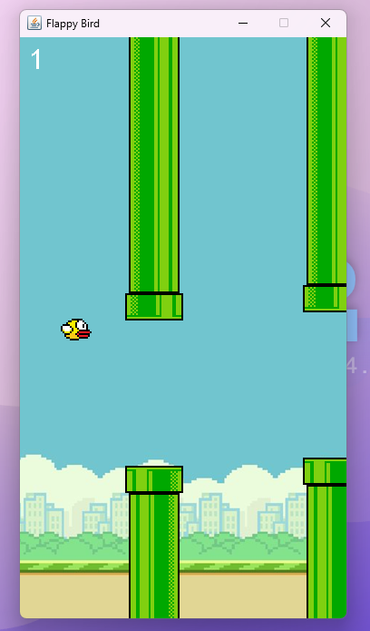

# Flappy Bird Remake

- A simple Flappy Bird remake in Java using basic game development concepts.

## Overview

- This project is a recreation of the classic Flappy Bird game, built with Java. The aim is to provide a simple implementation of the game mechanics and graphics, perfect for learning the basics of game programming in Java.

## Sample Screenshot

